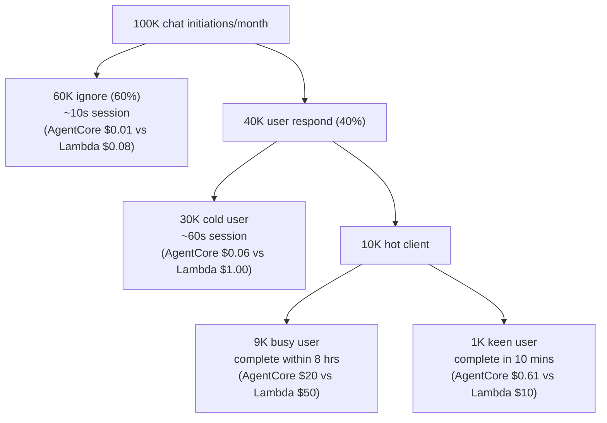
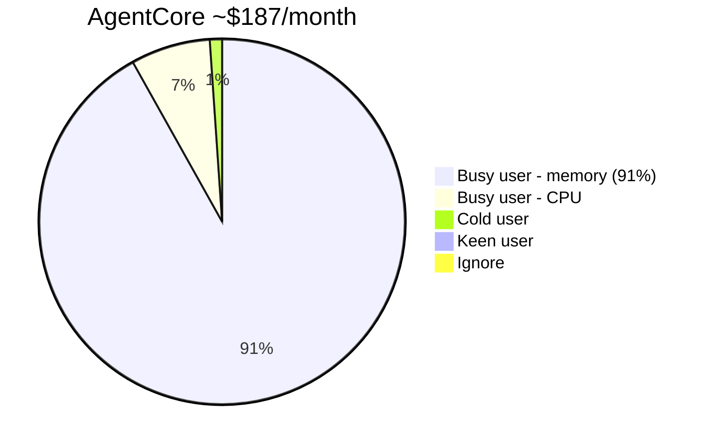
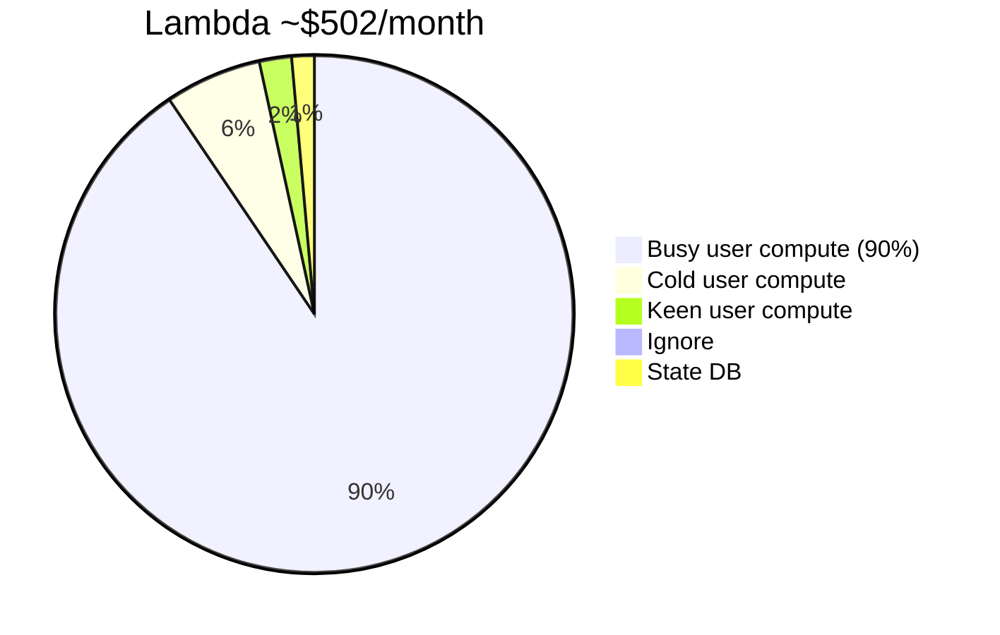
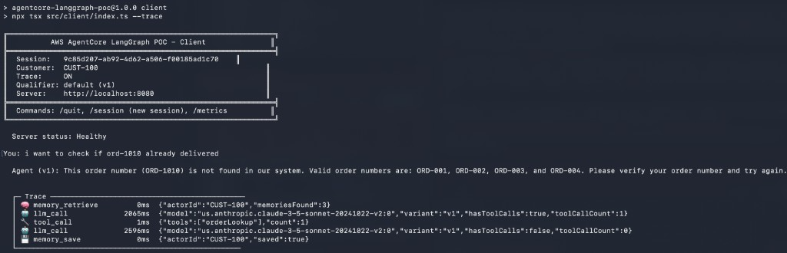
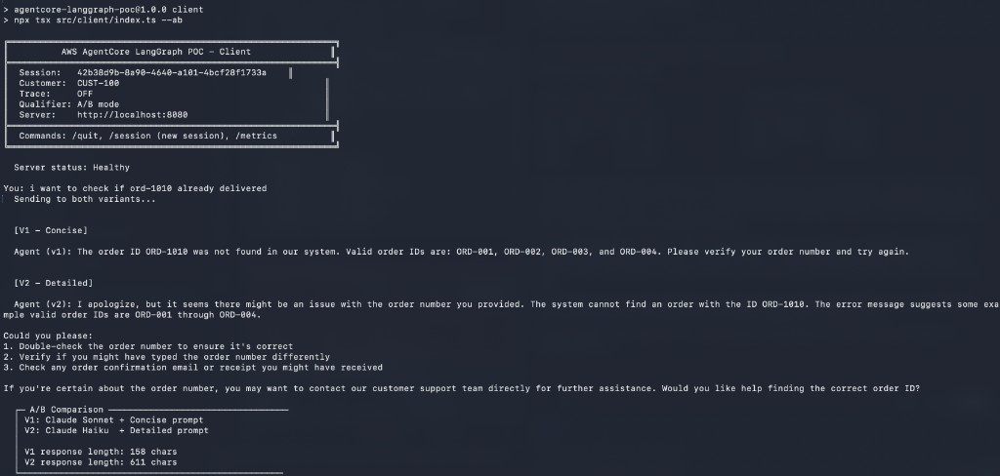
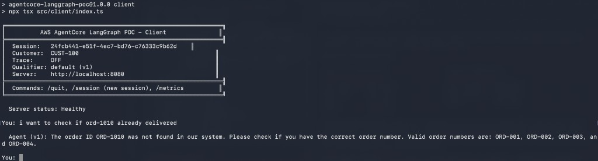

# AWS Bedrock AgentCore POC with LangGraph.js

Evaluating AWS Bedrock AgentCore as a runtime for LangGraph.js agents -- comparing architecture, cost, and developer experience against Lambda.

---

## 1. Use Case Scenario

A **requirement gathering agent** for discretionary chat sessions. Users initiate conversations to discuss project requirements, ask clarifying questions, and refine specifications. Session patterns vary widely:



The busy 9% is the critical design driver -- these users keep sessions alive for hours but only actively chat for ~10 minutes total. This pattern heavily influences the architecture and cost comparison below.

---

## 2. Technical Requirements

This POC must demonstrate four agent capabilities:

| Requirement | Description |
|-------------|-------------|
| **Memory management** | Short-term (per-session conversation state) + long-term (cross-session user preferences and facts) |
| **MCP / tool use** | Agent can invoke external tools (order lookup, FAQ search, account info) via structured tool calls |
| **Simple workflow** | Customer enquiry -> agent decides tool use / memory retrieval -> agent response |
| **Traceability** | OTEL spans per graph node, distributed trace header propagation, inline trace data returned to caller |

Additionally, the POC explores **A/B testing** (different models and prompts per variant) and compliance with the **AgentCore Runtime HTTP contract** (port 8080, `/invocations`, `/ping`).

---

## 3. High-Level Architecture

### Capability Model: Managed Service vs Self-Managed

Every agent needs these capabilities. The question is who operates them.

```
┌─────────────────────┬───────────────────────────┬──────────────────────────┐
│                     │  Lambda + LangGraph       │  AgentCore + LangGraph   │
│  Capability         │  (self-managed)           │  (managed service)       │
├─────────────────────┼───────────────────────────┼──────────────────────────┤
│                     │                           │                          │
│  Compute            │  Lambda + API Gateway     │  AgentCore Runtime       │
│  & Scaling          │  + scaling config         │  (serverless, auto-      │
│                     │                           │   scaling, microVM)      │
│                     │                           │                          │
├─────────────────────┼───────────────────────────┼──────────────────────────┤
│                     │                           │                          │
│  Session            │  DynamoDB tables          │  AgentCore Runtime       │
│  State              │  + serialize/deserialize  │  (in-process, auto-      │
│                     │  + TTL management         │   persisted per session) │
│                     │                           │                          │
├─────────────────────┼───────────────────────────┼──────────────────────────┤
│                     │                           │                          │
│  Short-Term         │  DynamoDB / Redis         │  AgentCore Memory        │
│  Memory             │  + custom checkpointer   │  (AgentCoreMemorySaver)  │
│                     │                           │                          │
├─────────────────────┼───────────────────────────┼──────────────────────────┤
│                     │                           │                          │
│  Long-Term          │  DynamoDB / Redis         │  AgentCore Memory        │
│  Memory             │  + custom extraction      │  (AgentCoreMemoryStore,  │
│                     │  + retrieval logic        │   auto-extracts prefs)   │
│                     │                           │                          │
├─────────────────────┼───────────────────────────┼──────────────────────────┤
│                     │                           │                          │
│  Tool               │  Custom HTTP clients      │  AgentCore Gateway       │
│  Integration        │  + auth management        │  (API -> MCP, managed    │
│                     │  + error handling         │   OAuth & credentials)   │
│                     │                           │                          │
├─────────────────────┼───────────────────────────┼──────────────────────────┤
│                     │                           │                          │
│  Observability      │  X-Ray SDK + OTEL         │  AgentCore Observability │
│  & Tracing          │  + CloudWatch config      │  (ADOT auto-instrument,  │
│                     │  + dashboard setup        │   zero-config dashboards)│
│                     │                           │                          │
├─────────────────────┼───────────────────────────┼──────────────────────────┤
│                     │                           │                          │
│  Auth &             │  Cognito / custom auth    │  AgentCore Identity      │
│  Identity           │  + token validation       │  (inbound SigV4/OAuth,   │
│                     │  + secret management      │   outbound token mgmt)   │
│                     │                           │                          │
├─────────────────────┼───────────────────────────┼──────────────────────────┤
│                     │                           │                          │
│  Session            │  Not available            │  AgentCore Runtime       │
│  Isolation          │  (shared execution env)   │  (dedicated microVM,     │
│                     │                           │   memory sanitized)      │
│                     │                           │                          │
├─────────────────────┼───────────────────────────┼──────────────────────────┤
│                     │                           │                          │
│  Versioning         │  Lambda aliases +         │  AgentCore Versioning    │
│  & A/B Testing      │  API Gateway stages       │  (immutable versions,    │
│                     │  + custom metrics         │   qualifier routing)     │
│                     │                           │                          │
├─────────────────────┼───────────────────────────┼──────────────────────────┤
│                     │                           │                          │
│  Agent-to-Agent     │  Custom implementation    │  A2A Protocol            │
│  Communication      │  (REST / queues)          │  (built-in discovery     │
│                     │                           │   & agent cards)         │
│                     │                           │                          │
├─────────────────────┴───────────────────────────┴──────────────────────────┤
│                                                                            │
│  OPERATIONAL BURDEN                                                        │
│                                                                            │
│  Lambda:    10 capabilities x self-managed = high ops burden               │
│  AgentCore: 10 capabilities x managed      = low ops burden               │
│                                                                            │
│  You focus on: agent logic, prompts, tool definitions                      │
│  AgentCore handles: everything else                                        │
│                                                                            │
└────────────────────────────────────────────────────────────────────────────┘
```

### Fitness to Requirements

| Requirement | Lambda + LangGraph | AgentCore + LangGraph |
|-------------|-------------------|----------------------|
| Short-term memory | Requires DynamoDB (serialize every invocation) | Built-in `AgentCoreMemorySaver` |
| Long-term memory | Requires DynamoDB/Redis + custom logic | Built-in `AgentCoreMemoryStore` (auto-extracts) |
| Tool use | Native in LangGraph | Native + AgentCore Gateway (MCP) |
| Traceability | Manual OTEL + X-Ray SDK | Auto ADOT instrumentation, zero-config |
| Session isolation | Shared execution env | Dedicated microVM per session |
| A/B testing | API Gateway stages + custom metrics | Qualifier param + named endpoints |
| Max session | 15 minutes | 8 hours (configurable) |

---

## 4. Comparison

### 4.1 Pros and Cons

| | AgentCore + LangGraph | Lambda + LangGraph |
|---|---|---|
| **Pros** | Managed memory (short + long-term) | Mature ecosystem, large community |
| | Session isolation (microVM) | Simple for stateless workloads |
| | I/O wait is free (no CPU charge) | Broad tooling and examples |
| | Auto-instrumented observability | Fine-grained IAM integration |
| | A/B testing via qualifiers | Pay-per-invocation at small scale |
| | 8-hour session support | |
| | Multi-protocol (HTTP, MCP, A2A) | |
| **Cons** | Newer service, fewer community examples | Pay for I/O wait (30-70% of agent time) |
| | JS/TS SDK still maturing | 15-minute max execution |
| | Vendor lock-in to AWS AgentCore | Need external state management (DynamoDB) |
| | Cold start for new sessions | Manual observability setup |
| | | No built-in A/B testing |
| | | No session isolation guarantee |
| | | Long sessions need Step Functions |

### 4.2 Cost Analysis

**Scenario:** Requirement gathering agent, 100K initiations/month.

| Tier | Sessions | Duration | Active CPU | I/O Wait | Memory |
|------|----------|----------|------------|----------|--------|
| Ignore (60%) | 60K | ~10s | 5s | 5s | 512 MB |
| Cold user (30%) | 30K | ~60s | 18s | 42s | 1 GB |
| Keen user (1%) | 1K | ~600s | 180s | 420s | 2 GB |
| Busy user (9%) | 9K | ~28,800s | 600s | 28,200s | 2.5 GB |

**Monthly cost:**

| | AgentCore | Lambda |
|---|---|---|
| Compute | ~$187 | ~$502 |
| State management | $0 (in-process) | ~$7 (DynamoDB) |
| **Total** | **~$187** | **~$509** |
| Cost per initiation | $0.0019 | $0.0051 |
| **Savings** | **63% less** | baseline |

**Where does the money go?**





> **Key insight:** Agent workloads are ~70% I/O wait (waiting for LLM responses, tool calls). AgentCore does not charge CPU during I/O wait. Lambda charges for the full duration. For the busy user pattern (9% of users, 8-hour sessions with ~10 min active use), AgentCore is ~99% cheaper on CPU -- the remaining cost is memory, which is billed regardless of activity on both platforms.

---

## 5. How to Use This AgentCore Demo

### 5.1 Quick Start

Requires Node.js 20+, AWS credentials with Bedrock model access (Claude 3.5 Sonnet + Haiku), region `us-west-2`.

```bash
npm install
npm run dev          # Start the agent server (terminal 1)
npm run client       # Run the client (terminal 2)
```

| Client mode | Command |
|-------------|---------|
| Basic conversation | `npm run client` |
| With traceability | `npm run client -- --trace` |
| A/B comparison | `npm run client -- --ab` |
| Target variant | `npm run client -- --qualifier v2` |

In-client commands: `/quit`, `/session` (new session), `/metrics` (A/B metrics).

### 5.2 Demo Screenshots

#### 5.2.1 Check Order

`npm run client`

The agent uses the `orderLookup` tool to check order status. When the order ID is not found, it returns valid IDs to help the customer.



#### 5.2.2 A/B Test Response Comparison

`npm run client -- --ab`

The same prompt is sent to both variants. V1 (Claude Sonnet + concise prompt) gives a direct answer. V2 (Claude Haiku + detailed prompt) provides empathetic guidance with next steps.



#### 5.2.3 Traceability

`npm run client -- --trace`

Each graph node is timed and reported: memory retrieval, LLM calls (with model ID), tool execution, and memory save. This mirrors what AgentCore Observability captures in CloudWatch.


